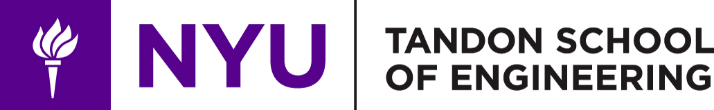

​

# Heading 1 level

## Heading 2 level

### Heading 3 level

#### Heading 4 level

##### Heading 5 level

###### Heading 6 level

~~Strikethrough text~~

**FATtext (bold)**

- Level of mark 1
- Level of mark 2
- Level of mark 3
- Level of mark 4
- Level of mark 5
- Level of mark 6

- Level 1
	- Level 2
		- Level 3
		- Level 4

- Level 1
	- Level 2
		- Level 3
		- Level 4

# LIST OF YOUR SUBJECTS

- [x] git add .
- [ ] git commit -m "new modified"
- [x] git push
- [ ] see on git :)

# TEXT OF THE LINK
[twitter](https://twitter.com)

# TABLES

| LEFT | CENTER | RIGHT |
|--------------|:----------:|-----------:|
| ON LEFT SIDE |BY CENTER |   ON RIGHT SIDE|
| TEXT | TEXT| TEXT |

# SYNTAX ON
hi `Aigo`
here -> `lalalalala` will be light!

# Program Deskription

`The bridge program is an intensive study of the required topics which are requisite information for general admission into the NYU-Tandon CSE graduate program. Conventionally, covering these topics take three to four semesters to complete and must be done sequentially. Under the bridge program, you will complete your studies in one, intensive, semester which includes all of the material from the conventional courses in a more compact form. The bridge will require as much as 100 hours of study, but scheduling of each module can be done at a time of your discretion, due to the online nature of the program. Working at an average of about 16 hours of study each week, the bridge program will be completed in one semester. You are expected, and required to attend a weekly online meeting as well.`